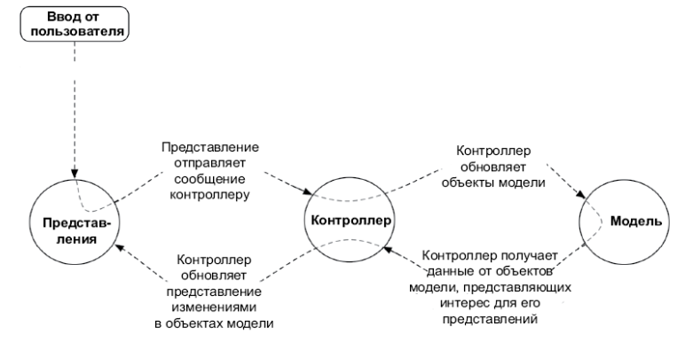
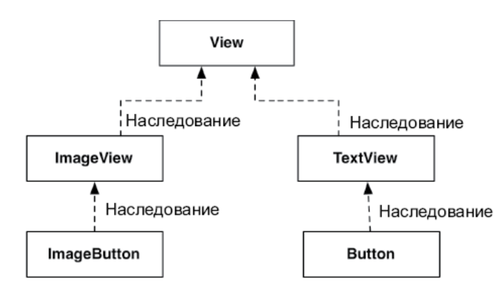

# 2. Android и модель MVC

* **@StringRes** помогает встроенному в Android Studio инспектору кода (под названием Lint) проверить во время компиляции, что в конструкторе используется правильный строковый идентификатор ресурса. Это предотвращает сбои во время выполнения, когда конструктор используется с недействительным идентификатором ресурса (например, если идентификатор указывает не на строку). И аннотация делает ваш код более читаемым для других разработчиков.

## **Паттерн MVC**

* Аттрибут **tools:text** - указывает строку по умолчанию для вкладки Design, которая будет отображаться в TextView в предварительном просмотре макета

## **Суффиксы имен каталогов**
* Суффиксы имен каталогов обозначают экранную плотность пикселов устройства.
* **mdpi** Средняя плотность (~160 dpi)
* **hdpi** Высокая плотность (~240 dpi)
* **xhdpi** Сверхвысокая плотность (~320 dpi)
* **xxhdpi** Сверхсверхвысокая плотность (~480 dpi) 
* **xxxhdpi** Сверхсверхсверхвысокая плотность (~640 dpi)

* Android автоматически масштабирует изображение к подходящему размеру. Благодаря этому обстоятельству необязательно предоставлять изображения для всех категорий плотности. Для сокращения размера приложения можно сосредоточиться на одной или нескольких категориях высокой плотности и выборочно оптимизировать графику для уменьшенного разрешения, когда автоматическое масштабирование Android создает артефакты на устройствах с низким разрешением.

* **Кегль текста** — это высота пикселов текста на экране устройства

##  **Плотность пикселов:**

* **px** - Сокращение от pixel — пиксел. Один пиксел в настройках соответствует одному пикселу на реальном экране, независимо от плотности отображения. Так как пикселы не масштабируются под плотность экрана устройства, не рекомендуется использовать такие единицы измерения.

* **dp** - Сокращение от density-independent pixel (плотностно- независимый пиксел). Обычно эта единица измерения используется для полей, отступов или чего-либо еще, для чего в противном случае пришлось бы задавать размер в пикселах. Один dp всегда составляет 1/160 дюйма на экране устройства. Размер получится одинаковым, независимо от плотности экрана: при более высокой плотности экрана 1 dp просто будет включать больше пикселов, чтобы геометрический размер элемента сохранился.

* **sp** - Сокращение от scale-independent pixel (масштабно- независимый пиксел). Это такие не зависящие от плотности пикселы, которые также учитывают предпочтения пользователя в отношении размера шрифта. Эта единица почти всегда используется для установки размера текста на экране.

* **pt, mm, in** - Масштабируемые единицы, как и dp, которые позволяют задавать размеры интерфейса в точках (1/72 дюйма), миллиметрах или дюймах. Однако мы не рекомендуем их использовать: не все устройства будут правильно масштабировать такие единицы.

## **Диаграмма наследования ImageButton и Button**

* Атрибут **android:contentDescription** обеспечивает доступность контента для читателей с ослабленным зрением. Строка, заданная этому атрибуту,
читается экранным диктором (при соответствующих настроек в системе пользователя)