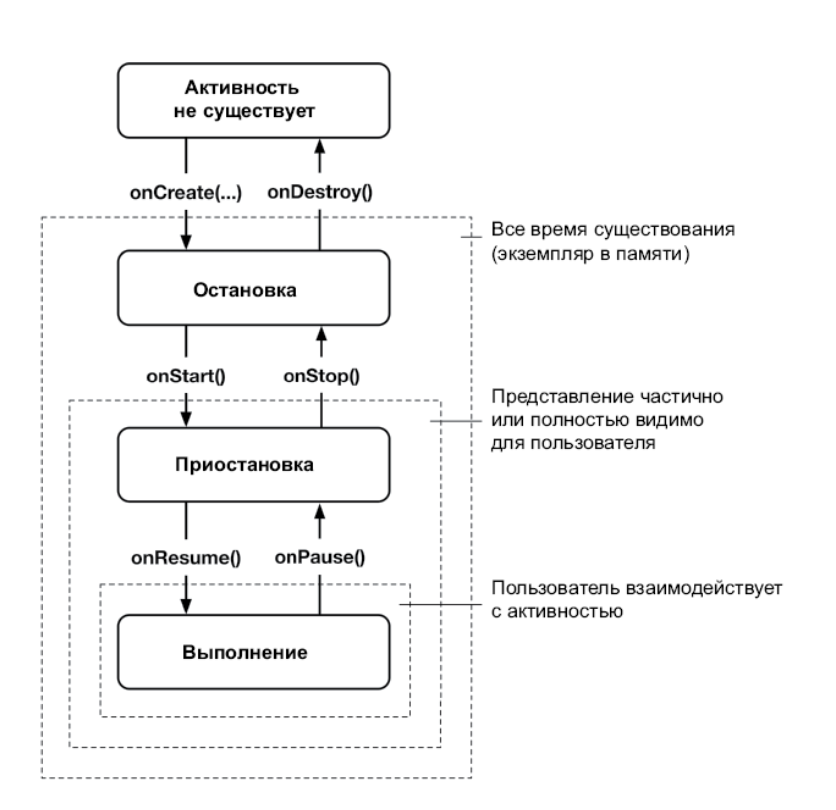
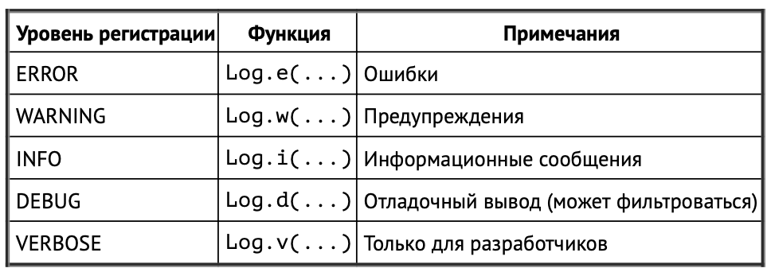

# 3. Жизненный цикл activity

## **Диаграмма состояния activity**

* Эти функции часто называются **обратными вызовами жизненного цикла**

## **Состояния activity**
---
Состояние | Находится в памяти? | Видима ли для пользователя? | На переднем плане? |
------------ | ------------- | ------------ | ------------ 
Activity не существует | Нет | Нет | Нет |
Activity остановлена | Да | Нет | Нет |
Activity приостановлена | Да | Да/частично* | Нет |
Activity выполняется | Да | Да | Да |
* *В зависимости от обстоятельств приостановленная activity может быть видима полностью или частично
---

* **Несуществующей** называется activity, которая еще не была запущена либо только что была уничтожена (например, если пользователь нажал кнопку «Назад»).

* **Остановленной** называется activity, экземпляр которой находится в памяти, но на экране ее не видно. Это переходное состояние возникает, когда activity запускается, и повторяется всякий раз, когда представление полностью закрыто (например, когда пользователь выводит другую activity на передний план, нажимает кнопку «Главная» или использует список приложений для переключения задач).

* **Приостановленная** activity видна, хоть и не на переднем плане. Это возможно, например, когда пользователь запускает новое диалоговое окно с темой или прозрачное действие поверх нее.

* **Выполняемая** activity находится в памяти, полностью видима и находится на переднем плане. Это та activity, с которой пользователь в данный момент взаимодействует.

## **Метод onCreate(Bundle?)**

ОС вызывает эту функцию после создания экземпляра activity, но до его отображения на экран. Как правило, activity переопределяет onCreate(Bundle?) для подготовки пользовательского интерфейса в следующем порядке:

* заполнение виджетов и их вывод на экран (вызов setContentView(int));

* получение ссылок на заполненные виджеты;

* назначение слушателей виджетам для обработки взаимодействия с пользователем;

* подключение к внешним данным модели.

## **Вызовы реализаций суперкласса, super.onPause()**

* Вызовы реализаций суперкласса обязательны. Вызов реализации суперкласса должен располагаться в первой строке реализации переопределения любой функции обратного вызова.

## **Поворот экрана**

* Поворот приводит к изменению **конфигурации устройства**. Конфигурация устройства представляет собой набор характеристик, описывающих текущее состояние конкретного устройства. К числу характеристик, определяющих конфигурацию, относится ориентация экрана, плотность пикселов, размер экрана, тип клавиатуры, режим стыковки, язык и многое другое

* При изменении конфигурации во время выполнения может оказаться, что приложение содержит ресурсы, лучше подходящие для новой конфигурации. По этой причине Android уничтожает activity, ищет ресурсы, которые лучше всего подходят для новой конфигурации, и заново строит экземпляр activity с этими ресурсами.

* Список конфигурационных квалификаторов, поддерживаемых Android, и обозначаемых ими компонентов конфигурации устройств находится по адресу **developer.android.com/guide/topics/resources/providing-resources.html**.

## **FrameLayout**

* **FrameLayout** — это самый простой вариант ViewGroup, в котором дочерние объекты не организованы каким-то конкретным образом.

## **Функции и уровни регистрации**
