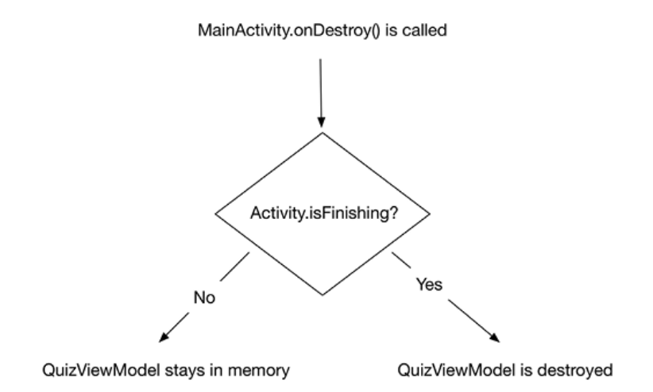
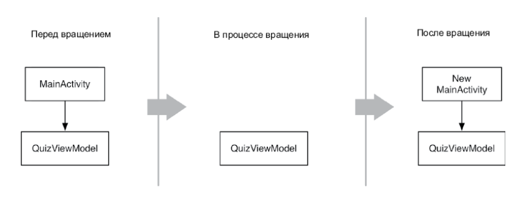
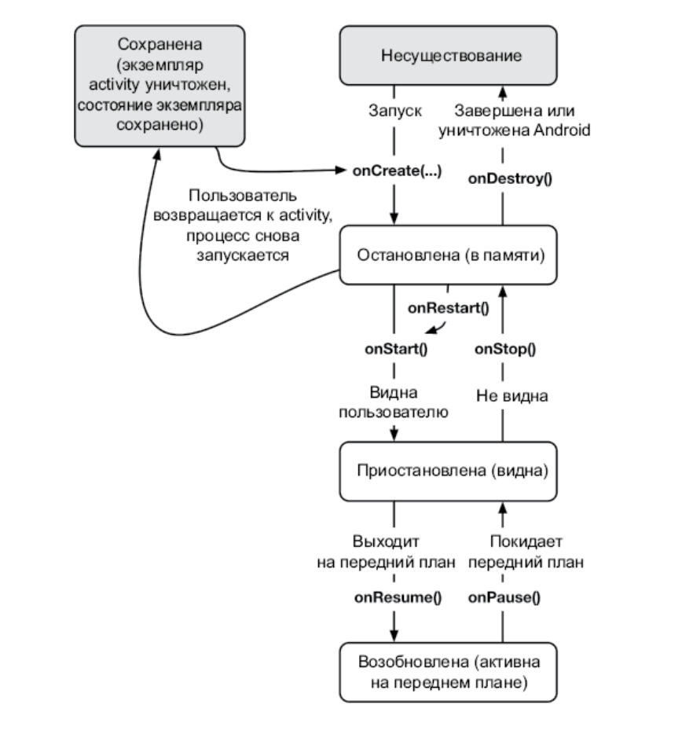

# 4. Сохранение состояния интерфейса

## **build.gradle**

* В вашем проекте есть два файла build.gradle: один для проекта в целом и один для модуля приложения.

* Cтрока **implementation fileTree(dir: 'libs', include: ['*.jar'])** в разделе dependencies гласит, что проект зависит от всех .jar файлов в каталоге libs.

---

## **ViewModel**

* Объект **ViewModel** связан с модельным объектом и «декорирует» модель, добавляя ей функциональность для отображения на экране, которая в самой модели вам не нужна. 

* **ViewModel** позволяет собрать все данные о том, что должно быть на экране, в одном месте, отформатировать данные и легко получить доступ к конечному результату

* ViewModel входит в состав пакета **androidx.lifecycle**, в котором также есть связанные с жизненным циклом API, в том числе зависимые от жизненного цикла. Такие компоненты наблюдают за жизненным циклом другого компонента, например activity, и используют эту информацию в своих целях.

* Функция **onCleared()** вызывается непосредственно перед уничтожением ViewModel. В этом месте удобно выполнять уборку мусора, например снимать наблюдение с источника данных.

* Класс **ViewModelProviders** предоставляет экземпляры класса ViewModelProvider. Вызов **ViewModelProviders.of(this)** создает и возвращает ViewModelProvider, связанный с activity.

* **ViewModelProvider**, в свою очередь, передает activity экземпляр ViewModel. Вызов provider.get(QuizViewModel::class.java) возвращает экземпляр QuizViewModel. Обычно эти функции идут вместе, например:
**ViewModelProviders.of(this).get(QuizViewModel::class.java)**

* ViewModel никогда не должен ссылаться на activity или виджет, иначе получится **утечка памяти**. Утечка памяти возникает тогда, когда один объект содержит ссылку на другой объект, который должен быть разрушен. Такая ссылка не дает сборщику мусора удалить объект из памяти. Утечки памяти из-за изменения конфигурации возникают часто.

* Библиотека **lifecycle-viewmodel-savedstate**, выпущенная недавно с целью позволить ViewModel сохранять свое состояние после завершения процесса

---

## **Состояние ViewModel**

---

## **Сохраненное состояние экземпляра**

* Сохраненное состояние экземпляра — это данные, которые ОС временно сохраняет за пределами activity. Вы можете добавить значения в сохраненное состояние экземпляра путем переопределения Activity.**onSaveInstanceState(Bundle)**.

* **Объект Bundle** - структура, которая отображает строковые ключи к значениям определенных типов.

---

## **Полный жизненный цикл activity**

* Когда вызывается onSaveInstanceState(Bundle), данные сохраняются в объекте Bundle. Этот объект Bundle затем сохраняется в **записи activity** в ОС.

* Когда activity сохранена, сам объект Activity не существует, но запись об activity сохранена в ОС. ОС может восстановить activity с помощью этой записи, если необходимо.

* На момент написания книги не существует простого способа определить, была ли activity воссоздана после уничтожения процесса или изменения конфигурации.