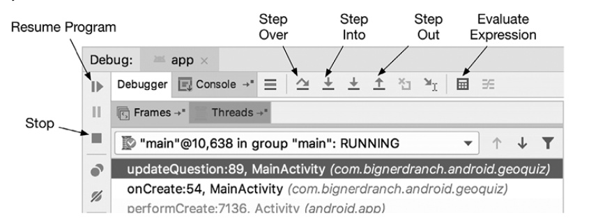

# 5. Отладка Android-приложений

* В отчете приводится исключение верхнего уровня и данные трассировки стека; затем исключение, которое привело к этому исключению, и его трассировка стека; и так далее, пока не будет найдено исключение, не имеющее причины.

---

## **Сохранение трассировки стека**

* Версия Log.d с сигнатурой **Log.d(String,String,Throwable)** регистрирует в журнале все данные трассировки стека

---

## **Установка точек останова**

---

## **Android Lint**

* **Android Lint** — статический анализатор кода Android. Статические анализаторы проверяют код на наличие дефектов, не выполняя его. Android Lint использует свое знание инфраструктуры Android для проверки кода и выявления проблем, которые компилятор обнаружить не может. Как правило, к рекомендациям Android Lint стоит прислушиваться.

---

## **Layout Inspector** и **Profiler**

* Для диагностики проблем с файлами интерактивного анализа визуализации макета на экране можно воспользоваться инструментом **Layout Inspector**. Находится: **View⇒ToolWindows⇒Layout Inspector**

* С помощью инструмента **Profiler** создаются подробные отчеты о том, как ваше приложение использует ресурсы Android- устройства, а именно процессор и память. Это полезно при оценке и настройке производительности вашего приложения.
Находится: **View⇒ToolWindows⇒Profiler**