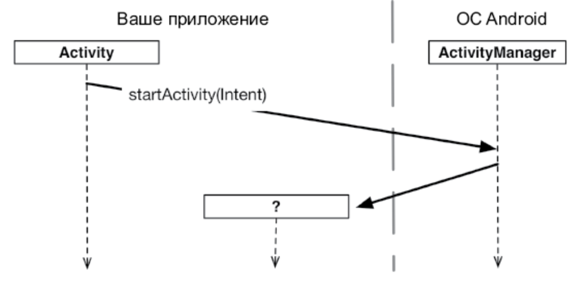
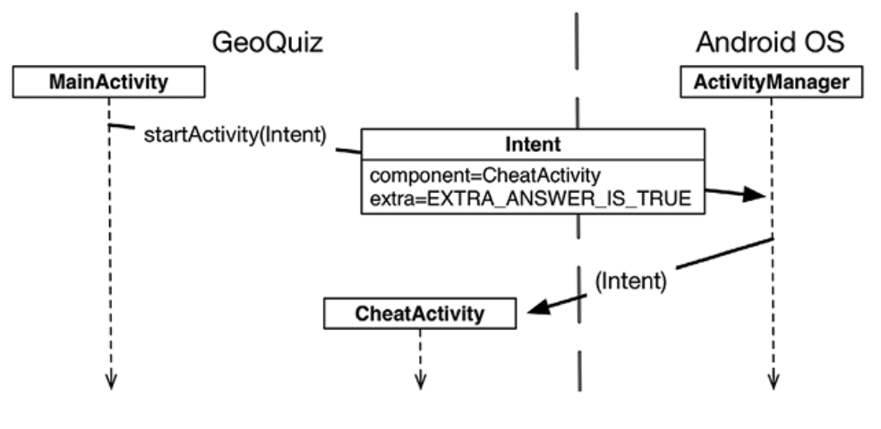
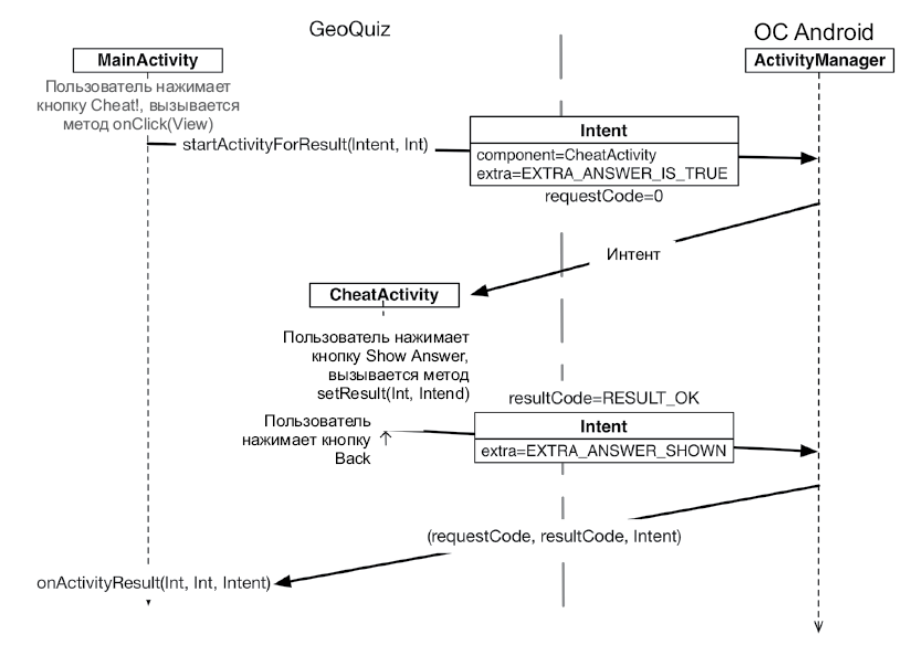

# 6. Вторая activity

## **Манифест**

* **Манифест (manifest)** представляет собой XML-файл с метаданными, описывающими ваше приложение для ОС Android.

---

## **Запуск activity**

* Чтобы запустить одну activity из другой, проще всего воспользоваться функцией **startActivity(Intent)**.

* Напрашивается предположение, что startActivity(Intent) — статическая функция, которая должна вызываться для запускаемого подкласса Activity. Тем не менее это не так. Когда activity вызывает startActivity(Intent), этот вызов передается ОС.

* Точнее, он передается компоненту ОС, который называется **ActivityManager**. ActivityManager создает экземпляр Activity и вызывает его функцию onCreate(Bundle?).

* Откуда ActivityManager узнает, какую activity следует запустить? Эта информация передается в параметре **Intent**.

---

## **Передача информации через интенты**

* **Интент (intent)** — объект, который может использоваться компонентом для взаимодействия с ОС. Компонентами могут быть **activity**, **службы (services)**, **широковещательные приемники (broadcast receivers)** и **поставщики контента (content providers)**.

* Интенты представляют собой многоцелевые средства передачи информации, а класс Intent предоставляет разные конструкторы в зависимости от того, для чего должен использоваться интент.

* **Intent(packageContext:Context,class:Class<?>)** Аргумент Class передает конструктору Intent инструкции, какой класс activity должен запустить ActivityManager. Аргумент Context определяет, в каком пакете приложения ActivityManager должен искать класс activity.

* Прежде чем запустить activity, ActivityManager ищет в манифесте пакета объявление с именем, соответствующим заданному объекту Class. Если такое объявление будет найдено, activity запускается — все хорошо. Если объявление не найдено, выдается неприятное исключение ActivityNotFoundException, которое может привести к аварийному завершению приложения.

* **Дополнения (extra)** объекта Intent представляют собой произвольные данные в виде «ключ — значение», которые вызывающая activity может передать вместе с интентом. Их можно рассматривать как аналоги аргументов конструктора, несмотря на то что вы **не можете использовать произвольный конструктор с подклассом activity** (Android создает экземпляры activity и несет ответственность за их жизненный цикл). ОС направляет интент activity получателю, которая обращается к дополнению и извлекает данные.

* Как правило, код результата содержит одну из двух предопределенных констант: **Activity.RESULT_OK** или **Activity.RESULT_CANCELED**. (Также можно использовать другую константу, **RESULT_FIRST_USER**, как смещение при определении собственных кодов результатов.

* Вызов **setResult(...)** необязателен для дочерней activity. Если вам не нужно различать результаты или получать произвольные данные по интенту, просто разрешите ОС отправить код результата по умолчанию. Код результата всегда возвращается родителю, если дочерняя activity была запущена функцией startActivityForResult(...). Если функция setResult(...) не вызывалась, то при нажатии пользователем кнопки «Назад» родитель получит код Activity.RESULT_CANCELED.

