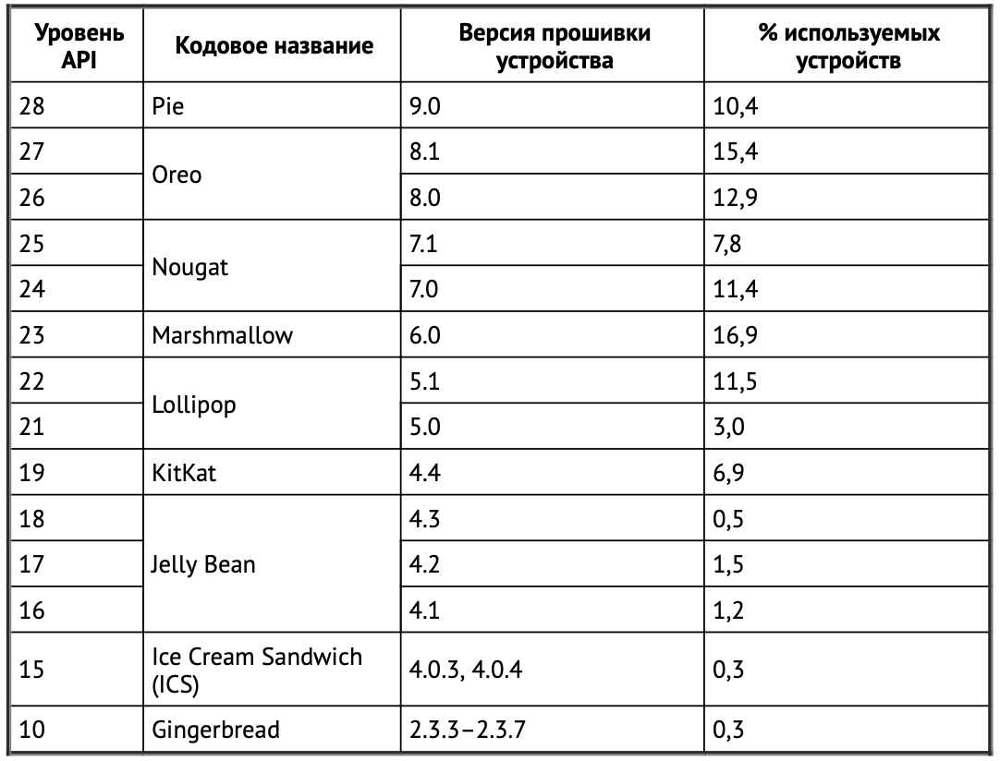

# 7. Версии Android SDK и совместимость

## **Версии Android SDK**

Ссылка: developer.android.com/about/dashboards/index.html.

* Почему на многих устройствах продолжают работать старые версии Android? В основном из-за острой конкуренции между производителями устройств Android и операторами сотовой связи.

* Самой старой версией Android, поддерживаемой в примерах книги, является API уровня 21 (Lollipop).

* В Android термины «версия SDK» и «уровень API» являются синонимам

* Кроме минимальной поддерживаемой версии также можно задать целевую версию (target version) и версию сборки (build version). Все эти свойства задаются в файле build.gradle в модуле app.

* **Минимальная версия SDK**. Значение **minSdkVersion** определяет нижнюю границу, за которой ОС отказывается устанавливать приложение.

* **Целевая версия SDK**. Значение **targetSdkVersion** сообщает Android, для какого уровня API проектировалось ваше приложение. Чаще всего в этом поле указывается новейшая версия Android.

* Если ваше приложение уже спроектировано, убедитесь в том, что в новых версиях оно работает так, как должно. За информацией о возможных проблемах обращайтесь к документации по адресу developer.android.com/reference/android/os/Build.VERSION_CODES.html.

* Важно отметить, что Google ограничивает нижнюю планку целевой SDK, если вы хотите отправить ваше приложение в Play Store. Это гарантирует, что пользователи смогут получить максимум от улучшений производительности и безопасности последних версий Android.

* **Версия SDK для компиляции**. Последний параметр SDK обозначен в листинге именем **compileSdkVersion**. Версия SDK, используемая для компиляции, указывает, какая версия должна использоваться при сборке вашего кода.

---

## **Безопасное добавление кода для более поздних версий API**

* В контексте настройки слушателя щелчка мыши лямбда-аргумент setOnClickListener'а представляет собой кликнутый виджет.

* Сообщения об ошибках будут выглядеть примерно так: «Call requires API level 23 (current min is 21)». Запуск кода с этим предупреждением возможен, но Lint знает, что это небезопасно.

* Как избавиться от ошибок? 
    * Первый способ — поднять минимальную версию SDK до 23. Однако тем самым вы не столько решаете проблему совместимости, сколько обходите ее. Если ваше приложение не может устанавливаться на устройствах c API уровня 23 и более старых устройствах, то проблема совместимости исчезает.
    
    * Другое, более правильное решение — заключить код более высокого уровня API в условную конструкцию, которая проверяет версию Android на устройстве.

* Коды версий доступны по адресу developer.android.com/reference/android/os/Build.VERSION_CODES.html

* Главная страница документации — developer.android.com. Она разделена на шесть частей: Platform, Android Studio, Google Play, Android Jetpack, Docs и News.

* Если вы хотите узнать, какие функции ActivityOptions доступны, скажем, в API уровня 21, отфильтруйте справочник по уровню API. 