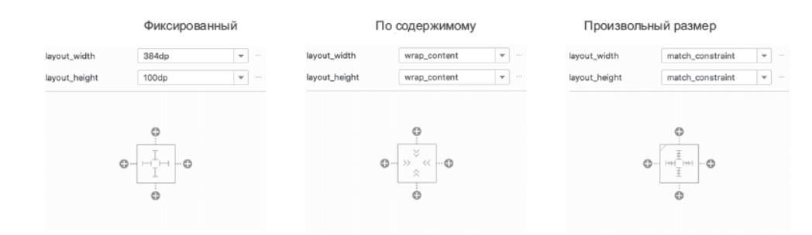

# 10. Создание интерфейсов с использованием макетов и виджетов

* Вложение макетов может ухудшить производительность вашего приложения. Вложенные макеты заставляют Android OS тратить много времени на расчеты и размещение, и у пользователей может возникнуть задержка в отображении элементов на экране.

* Плоские невложенные макеты быстрее измеряются и выводятся операционной системой. И это одна из областей, где **ConstraintLayout** работает действительно хорошо. Вы можете создавать красивые сложные макеты без использования вложенности.

---

## **Знакомство с ConstraintLayout**

* При использовании механизма ограничений макета ConstraintLayout вместо применения вложенных макетов в макет включается набор ограничений. Ограничение, словно резиновая лента, «притягивает» два визуальных объекта друг к другу.

* Как насчет определения размеров виджетов? Есть три варианта: предоставить выбор самому виджету (вашему старому знакомому wrap_content), решить самостоятельно или позволить виджету изменять свои размеры в соответствии с ограничениями.

---

## **Панель инструментов (Design)**

### **View Options**

* **ViewOptions⇒ShowAllConstraints** выводит заданные ограничения в режимах предварительного просмотра и раскладки.

* **ViewOptions⇒Show Layout Decorations** отображается панель приложения, а также некоторые системные интерфейсы (например, строка состояния), которые пользователь видит во время выполнения.

### **Autoconnect**

* При включении режима **Autoconnect** ограничения будут автоматически настраиваться при перетаскивании представлений в область предварительного просмотра. Android Studio старается угадать, какие ограничения должно иметь представление, и создавать их по мере необходимости.

### **Clear All Constraints**

* Кнопка **Clear All Constraints** удаляет все ограничения, существующие в файле макета. Вскоре мы воспользуемся этой кнопкой.

### **Infer Constraints**

* Как и кнопка **Autoconnect**, эта кнопка автоматически создает ограничения, но данная функциональность срабатывает только при нажатии кнопки. Функциональность **Autoconnect** срабатывает каждый раз, когда в файл макета добавляется новое представление.

---

## **Использование ConstraintLayout**

* Все атрибуты, начинающиеся с префикса layout, называются параметрами макета (layout parameters). В отличие от других атрибутов параметры макета представляют собой инструкции для родителя виджета, а не для самого виджета. Они сообщают родительскому макету, как он должен расположить дочерний элемент внутри себя.

* Пример с **app:layout_constraintTop_toTopOf="parent"** Имя ограничения **constraintTop** указывает на то, что это ограничение относится к верхней стороне ImageView. Наконец, атрибут завершается суффиксом **toTopOf="parent"**. Из него следует, что ограничение связывается с верхней стороной родителя.

---

## **Стили, темы и атрибуты тем**

* **Стиль (style)** представляет собой ресурс XML, который содержит атрибуты, описывающие внешний вид и поведение виджета.

* **Тема (theme)** представляет собой набор стилей. Со структурной точки зрения тема сама по себе — это ресурс стиля, атрибуты которого ссылаются на другие ресурсы стилей.

---

## **Нововведения в ConstraintLayout**

* В ConstraintLayout также есть вспомогательные виджеты, такие как **Guideline (направляющие)**, которые упрощают расположение элементов на экране. Направляющие не отображаются на экране приложения, но сами помогают расположить элементы так, как вам нужно. Существуют как горизонтальные, так и вертикальные направляющие, и их можно разместить в определенном месте на экране, используя значения dp или проценты от экрана. Потом эти направляющие можно использовать в качестве ограничений для элементов, даже если размер экрана будет изменяться.

* **MotionLayout** — это расширение ConstraintLayout, которое упрощает добавление анимации для элементов. Для использования MotionLayout вы создаете файл MotionScene, в котором описывается, как должна выполняться анимация и какие элементы сопоставляются друг с другом в начальном и конечном макетах. Вы также можете установить ключевые кадры для промежуточных точек анимации. MotionLayout выполняет анимацию из начального состояния через различные предоставляемые вами ключевые кадры, и так до финального положения.