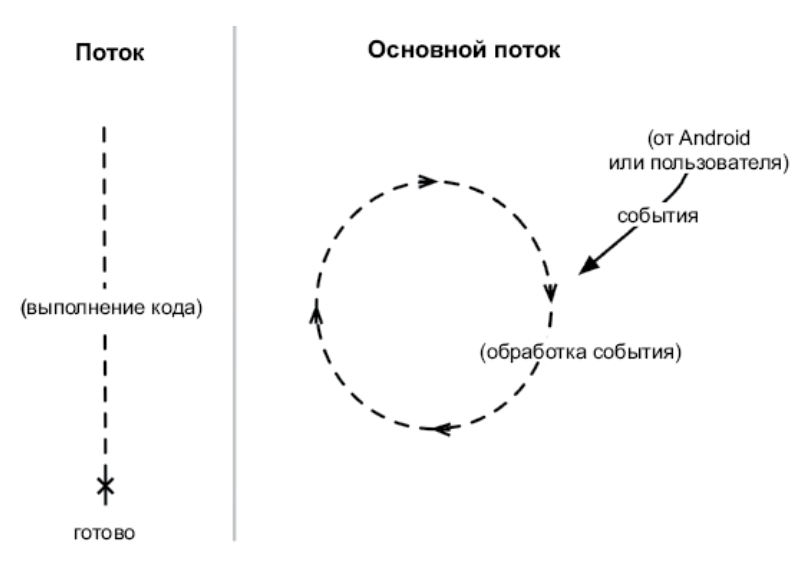

# 11. Базы данных и Room Library

## **Библиотека компонентов архитектуры Room**

* **Room** — это библиотека компонентов архитектуры Jetpack, позволяющая упростить настройку и доступ к базе данных. Она помогает определить структуру базы данных и запросов с помощью аннотированных классов Kotlin.

* Room состоит из **API, аннотаций и компилятора**. API содержит классы, которые вы будете расширять для определения базы данных и создания ее экземпляра. Вы можете использовать аннотации, чтобы указать, например, что должно быть сохранено в базе данных, какой класс представляет вашу базу данных и какой класс определяет функцию доступа к таблицам базы данных. Компилятор обрабатывает аннотированные классы и генерирует реализацию базы данных.

* Плагин **kotlin-kapt** означает «инструмент обработки аннотаций Kotlin». Когда библиотека генерирует код, вам наверняка захочется использовать эти сгенерированные классы непосредственно в коде. Но по умолчанию эти сгенерированные классы не видны в Android Studio, так что при попытке импорта вы увидите сообщение об ошибке. Добавление плагина **kotlin-kapt** реализует поддержку сгенерированных файлов в Android Studio, поэтому вы можете импортировать их в свои классы.

* Первая добавленная зависимость **room-runtime** предназначена для API Room, содержащего все классы и аннотации, которые потребуются для определения базы данных. Вторая зависимость, **room-compiler**, нужна для компилятора Room, который будет генерировать вашу реализацию базы данных на основе заданных аннотаций. Компилятор использует ключевое слово **kapt** вместо **implementation**, поэтому сгенерированные классы от компилятора открыты для Android Studio благодаря плагину kotlin-kapt.

---

## **Создание базы данных**

* Создание базы данных с помощью Room делается в **три этапа**:

    * аннотирование класса модели, чтобы сделать его сущностью базы данных;
    * создание класса, который будет представлять саму базу данных;
    * создание конвертера типа, позволяющего базе данных обрабатывать ваши данные модели.

---

## **Определение сущностей**

* Room создает структуру таблицы базы данных для приложения, основываясь на определенных вами сущностях. **Сущности** — это классы моделей, аннотированные аннотацией **@Entity**. Room создаст таблицу базы данных для любого класса с такой аннотацией.

* Аннотация, **@Entity**, применяется на уровне класса. Эта аннотация указывает, что класс определяет структуру таблицы или набора таблиц в базе данных. В этом случае каждая строка в таблице будет представлять собой отдельные преступления. Каждое свойство, определенное в классе, превратится в столбец в таблице, при этом имя свойства станет именем столбца.

* Следующая аннотация — это **@PrimaryKey**, которую вы добавили к свойству id. Эта аннотация указывает, какой столбец в базе данных является первичным ключом. **Первичный ключ в базе данных** — это такой столбец, который содержит данные, уникальные для каждой записи или строки.

---

## **Создание класса базы данных**

* Аннотация **@Database** сообщает Room о том, что этот класс представляет собой базу данных в приложении. Самой аннотации требуется два параметра. 

    * **Первый параметр** — это список классов-сущностей, который сообщает Room, какие использовать классы при создании и управлении таблицами для этой базы данных. 
    * **Второй параметр** — версия базы данных. При первом создании базы данных версия должна быть равна 1. При будущей разработке приложения вы можете добавлять новые сущности и новые свойства существующим сущностям. В этом случае вам нужно будет изменить список сущностей и увеличить версию базы данных, чтобы обозначить факт изменения.

* CrimeDatabase расширяется от **RoomDatabase** и помечается как абстрактный, так что вы не можете создать экземпляр непосредственно от него.

---

## **Создание преобразователя типа**

* Под капотом у Room используется SQLite. **SQLite** — это реляционная база данных с открытым исходным кодом, как MySQL или PostgreSQL (SQL — сокращение Structured Query Language, стандартный язык, используемый для взаимодействия с базами данных). В отличие от других баз данных, SQLite хранит свои данные в простых файлах, которые вы можете считывать и записывать с помощью библиотеки SQLite.

* Room делает использование SQLite еще проще и чище, выступая в роли **объектно-реляционного отображения (ORM)** или слоя между вашими объектами Kotlin и реализацией базы данных.

* Чтобы научить Room преобразовывать типы данных, необходимо указать **преобразователь типов**. Преобразователь типа сообщает Room, как преобразовать специальный тип в формат для хранения в базе данных. Вам понадобятся две функции, к которым мы добавим аннотации **@TypeConverter** для каждого типа: 
    * первая сообщает Room, как преобразовывать тип, чтобы сохранить его в базе данных
    * вторая — как выполнить обратное преобразование.

* Объявление функции преобразователя не позволяет вашей базе данных использовать их. Вы должны явно добавить конвертеры к классу базы данных, добавив аннотацию @TypeConverters и передав класс CrimeTypeConverters.

---

## **Определение объекта доступа к данным**

* Первый шаг к взаимодействию с таблицами базы данных — это создать объект доступа к данным, или DAO. **DAO** — это интерфейс, который содержит функции для каждой операции с базой данных, которые вы хотите реализовать.

* Аннотация **@Dao** сообщает Room, что CrimeDao — это один из ваших объектов доступа к данным. Когда вы прикрепляете CrimeDao к вашему классу базы данных, Room будет генерировать реализации функций, которые вы добавляете к этому интерфейсу.

* Аннотация **@Query** указывает, что ф-и предназначены для извлечения информации из базы данных, а не вставки, обновления или удаления элементов из базы данных. 

* Теперь нам нужно связать класс DAO с классом базы данных. Поскольку CrimeDao представляет собой интерфейс, Room будет сам генерировать конкретную версию класса. Но для этого вы должны приказать классу базы данных создать экземпляр DAO.

---

## **Доступ к базе данных с помощью шаблона репозитория**

* Класс репозитория инкапсулирует логику для доступа к данным из одного источника или совокупности источников. Он определяет, как захватывать и хранить определенный набор данных — локально, в базе данных или с удаленного сервера. Ваш код UI будет запрашивать все данные из репозитория, потому что интерфейсу неважно, как фактически хранятся или извлекаются данные.

* CrimeRepository — это одноэлементный класс (синглтон). Это означает, что в вашем процессе приложения единовременно существует только один его экземпляр. Синглтон существует до тех пор, пока приложение находится в памяти, поэтому хранение в нем любых свойств позволяет получить к ним доступ в течение жизненного цикла вашей activity и фрагмента

* Когда класс приложения будет зарегистрирован в манифесте, операционная система создаст экземпляр CriminalIntentApplication при запуске вашего приложения. ОС будет вызывать функцию OnCreate() на экземпляре CriminalIntentApplication. CrimeRepository будет инициализирован, и вы сможете обращаться к нему из других компонентов.

* Функция **Room.databaseBuilder()** создает конкретную реализацию вашего абстрактного класса CrimeDatabase с использованием трех параметров. 

    * Сначала ему нужен объект Context, так как база данных обращается к файловой системе. Контекст приложения нужно передавать, так как синглтон, скорее всего, существует дольше, чем любой из ваших классов activity. 
    * Второй параметр — это класс базы данных, которую Room должен создать. 
    * Третий — имя файла базы данных, которую создаст Room. Нужно использовать приватную константу, определенную в том же файле, поскольку никакие другие компоненты не должны получать к ней доступ.

---

## **Потоки приложения**
 
* Чтение из базы данных происходит не мгновенно. Поскольку доступ может занимать много времени, Room запрещает все операции с базой данных в основном потоке. Если вы попытаетесь нарушить это правило, Room выбросит исключение **IllegalStateException**. 

* Поток представляет собой единую последовательность выполнения. Код, работающий в одном потоке, будет выполняться пошагово. Любое приложение на Android начинает работу в основным потоке. Но основной поток не является конкретным списком действий. Он находится в бесконечном цикле и ожидает наступления событий, инициированных пользователем или системой. Затем он выполняет код в ответ на эти события 

---

## **Фоновые потоки**

* Доступ к базе данных похож на телефонный звонок вашему дистрибьютору обуви: он занимает много времени по сравнению с другими задачами. В течение этого времени пользовательский интерфейс перестанет отвечать на запросы, которые **могут привести к зависанию приложения**.

* Есть два важных правила, которые следует учитывать при добавлении фоновых потоков:

    * **Все долго выполняющиеся задачи должны выполняться в фоновом потоке**. Это гарантирует, что основной поток сможет спокойно работать с интерфейсом и не нервировать пользователей.
    * **Пользовательский интерфейс обновляется только из основного потока**. Вы получите сообщение об ошибке, если попытаетесь изменить пользовательский интерфейс из фонового потока, поэтому нужно убедиться, что любые данные, полученные из фонового потока, направляются в основной поток для обновления пользовательского интерфейса.

---

## **Использование LiveData**

* Цель LiveData состоит в том, чтобы упростить передачу данных между различными частями вашего приложения, например от фрагмента CrimeRepository, который должен отображать данные о преступности. LiveData также позволяет организовать передачу данных между потоками.

* При настройке запросов в DAO на возврат LiveData Room будет автоматически выполнять эти запросы в фоновом потоке, а затем выводить результаты в объект LiveData.

* Функция **LiveData.observe(LifecycleOwner,Observer)**
используется для регистрации наблюдателя за экземпляром LiveData и связи наблюдения с жизненным циклом другого компонента. Второй параметр функции observe(...) — это реализация Observer. Этот объект отвечает за реакцию на новые данные из LiveData. В этом случае блок кода наблюдателя выполняется всякий раз, когда обновляется список в LiveData. Наблюдатель получает список преступлений из LiveData и печатает сообщение журнала, если свойство не равно нулю.