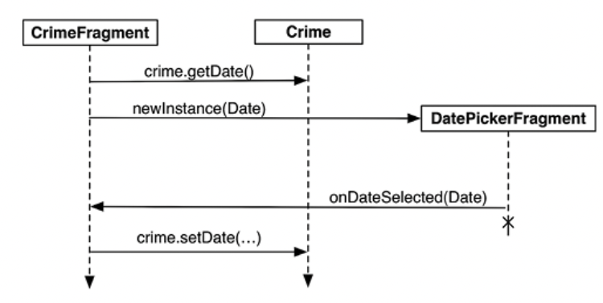

# 13. Диалоговые окна

* **AlertDialog** является универсальным подклассом **Dialog**, который вы будете использовать чаще всего для создания большего количества пользовательских диалоговых окон.

## **Создание экземпляра DialogFragment**

* При использовании объекта AlertDialog обычно **удобно упаковывать его в экземпляр DialogFragment подкласса Fragment**. Вообще говоря, экземпляр AlertDialog может отображаться и без DialogFragment, но Android так поступать не рекомендует. **Управление DatePickerDialog из FragmentManager открывает больше возможностей для его отображения**.

* Кроме того, «минимальный» экземпляр DatePickerDialog исчезнет при повороте устройства. С другой стороны, **если экземпляр DatePickerDialog упакован во фрагмент, после поворота диалоговое окно будет создано заново и появится на экране**.

* Наши первоочередные задачи:
    * создание класса DatePickerFragment;

    * построение DatePickerFragment;

    * вывод диалогового окна на экран с использованием FragmentManager.

* Класс DialogFragment содержит следующую функцию:
**onCreateDialog(savedInstanceState: Bundle?): Dialog**. Экземпляр FragmentManager хост-activity вызывает эту
функцию в процессе вывода DialogFragment на экран.  

* **Конструктор DatePickerDialog** принимает несколько параметров. Первый — это контекстный объект, который необходим для доступа к необходимым ресурсам элемента. Второй параметр — слушатель дат. Последние три параметра — это год, месяц и день, к которым должно быть инициализировано окно выбора даты.

---

## **Отображение DialogFragment**

* Для добавления экземпляра DialogFragment во FragmentManager и вывода его на экран используются следующие функции экземпляра фрагмента:
    * show(manager: FragmentManager, tag: String)
    * show(transaction: FragmentTransaction, tag: String)

* Строковый параметр однозначно идентифицирует DialogFragment в списке FragmentManager. Выбор версии (с FragmentManager или FragmentTransaction) зависит только от вас: **если передать FragmentTransaction, за создание и закрепление транзакции отвечаете вы**. **При передаче FragmentManager транзакция автоматически создается и закрепляется для вас**.

---

## **Передача данных между фрагментами**

* Чтобы передать дату преступления в DatePickerFragment, мы напишем функцию newInstance(Date) и сделаем объект Date аргументом фрагмента.

* Чтобы передать новые данные обратно в CrimeFragment и тем самым дать ему возможность обновить слой модели и свое представление, нужно объявить функцию интерфейса обратного вызова в DatePickerFragment, которая принимает новый параметр даты, как показано на рисунке.

---

## **Назначение целевого фрагмента**

* Для создания аналогичной связи можно назначить CrimeFragment **целевым фрагментом (target fragment)** для DatePickerFragment. Эта **связь будет автоматически восстановлена после того, как и CrimeFragment, и DatePickerFragment будут уничтожены и заново созданы ОС**. Для этого вызывается следующая функция Fragment: 

* **setTargetFragment(fragment: Fragment, requestCode: Int)**

* Функция получает фрагмент, который станет целевым, и код запроса, аналогичный передаваемому startActivityForResult(...). По коду запроса целевой фрагмент позднее может определить, какой фрагмент возвращает информацию.

* FragmentManager сохраняет целевой фрагмент и код запроса. **Чтобы получить их, обратитесь к свойствам targetFragment и targetRequestCode для фрагмента**, назначившего целевой фрагмент.
