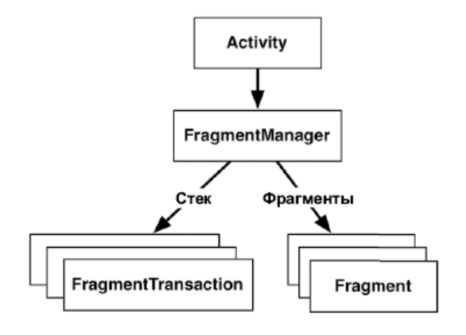

# 8. UI-фрагменты и FragmentManager

## **Знакомство с фрагментами**

* Фрагмент представляет собой объект контроллера, которому activity может доверить выполнение операций. Чаще всего такой операцией является управление пользовательским интерфейсом — целым экраном или его частью.

* В проекте **хостом (host)** экземпляра CrimeFragment является activity MainActivity

* UUID — вспомогательный класс Java, входящий в инфраструктуру Android, — предоставляет простой способ генерирования универсально-уникальных идентификаторов. В конструкторе такой идентификатор генерируется вызовом UUID.randomUUID().

* Обратите внимание на то, что **не** происходит во **Fragment.onCreate(Bundle?)**: мы не заполняем представление фрагмента. Экземпляр фрагмента настраивается во Fragment.onCreate(Bundle?), но создание и настройка представления фрагмента осуществляются в другой функции жизненного цикла фрагмента: **onCreateView(LayoutInflater,ViewGroup?,Bundle?)**. Параметры LayoutInflater и ViewGroup необходимы для заполнения макета.

* В функции **onCreateView(...)** мы явно заполняем представление фрагмента, вызывая LayoutInflater.inflate(...) с передачей идентификатора ресурса макета. Второй параметр определяет родителя представления, что обычно необходимо для правильной настройки виджета. Третий параметр указывает, нужно ли включать заполненное представление в родителя. Мы передаем false, потому что представление будет добавлено в контейнере activity. Представление фрагмента не нужно сразу добавлять в родительское представление — activity обработает этот момент позже.

---

## **Хостинг UI-фрагментов**

* Чтобы стать хостом для UI-фрагмента, activity должна:
    * определить место представления фрагмента в своем макете; 
    * управлять жизненным циклом экземпляра фрагмента.

* В проекте элемент FrameLayout станет контейнерным представлением для CrimeFragment. Обратите внимание: контейнерное представление абсолютно универсально; оно не привязывается к классу CrimeFragment. Мы можем использовать один макет для хостинга разных фрагментов.

---

## **Добавление UI-фрагмента во FragmentManager**

* Когда в Honeycomb появился класс Fragment, в класс Activity были внесены изменения: в него был добавлен компонент, называемый **FragmentManager**. FragmentManager работает с двумя вещами: списком фрагментов и обратным стеком транзакций (о котором вы скоро узнаете). Он отвечает за добавление представлений фрагментов в иерархию представлений activity и управление жизненными циклами фрагментов.

* Для добавления фрагмента в код activity выполняются явные вызовы во FragmentManager activity. Доступ к менеджеру фрагментов осуществляется с помощью свойства supportFragmentManager.

* Транзакции фрагментов используются для добавления, удаления, присоединения, отсоединения и замены фрагментов в списке фрагментов.

* **FragmentManager** ведет стек транзакций, по которому вы можете перемещаться. Если в транзакции присутствует несколько операций, то при удалении транзакции из обратного стека их порядок реверсируется.

* Функция **FragmentManager.beginTransaction()** создает и возвращает экземпляр FragmentTransaction. Класс FragmentTransaction использует **динамичный интерфейс**: функции, настраивающие FragmentTransaction, возвращают FragmentTransaction вместо Unit, что позволяет объединять их вызовы в цепочку. Таким образом, выделенный код в приведенном выше листинге означает: «Создать новую транзакцию фрагмента, включить в нее одну операцию **add**, а затем закрепить».

* Важное различие между жизненным циклом фрагмента и жизненным циклом activity заключается в том, что **функции жизненного цикла фрагмента вызываются не операционной системой, а диспетчером хостинга**, выполняющим эти функции. Операционная система ничего не знает о фрагментах, которые она использует для управления. Фрагменты — это внутренняя кухня activity. Функции OnAttach(Context?), onCreate(Bundle?), onCreateView(...) и onViewCreated(...) вызываются при добавлении фрагмента во FragmentManager.

* **Фрагменты предназначены для инкапсуляции основных компонентов для повторного использования**. В данном случае основные компоненты находятся на уровне всего экрана приложения. Если на экран одновременно выводится большое количество фрагментов, ваш код замусоривается транзакциями фрагментов и неочевидными обязанностями. С точки зрения архитектуры существует другой, более правильный способ организации повторного использования вторичных компонентов — выделение их в специализированное представление (класс, являющийся подклассом View или один из его подклассов). На практике не рекомендуется отображать более двух или трех фрагментов одновременно.

* Если вам не нужны фрагментозависимые API, то фрагменты будут полезны в больших приложениях с большими требованиями. Для простых одноэкранных приложений это будет излишняя сложность.