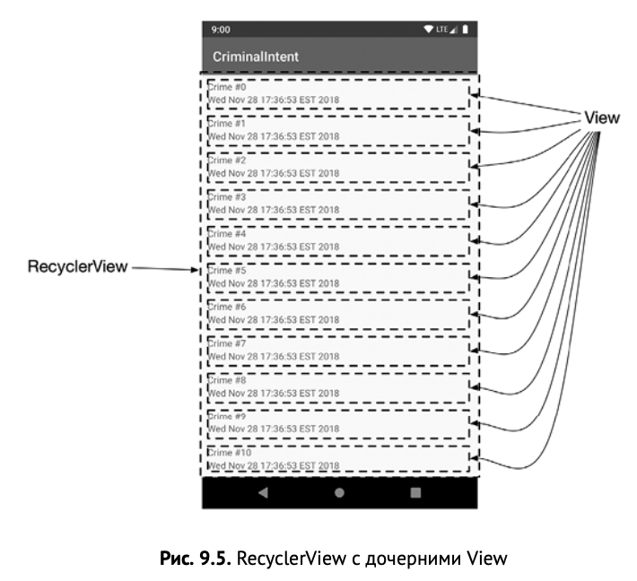
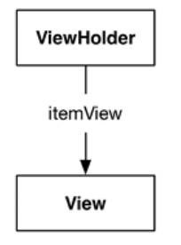
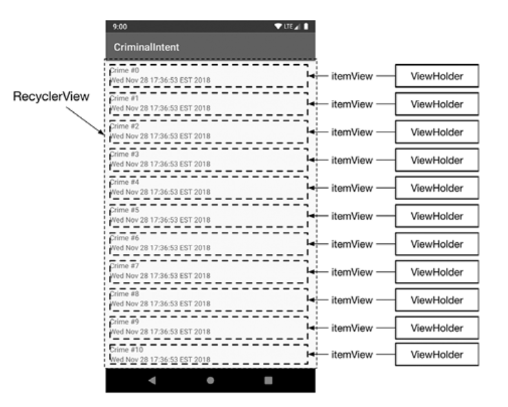
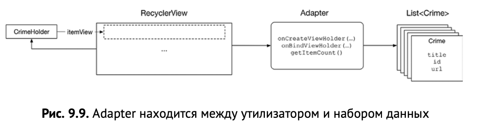
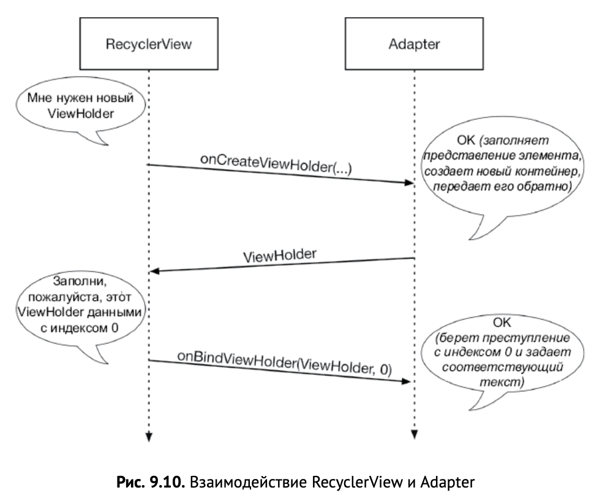

# 9. Вывод списков и RecyclerView

## **Добавление нового фрагмента и ViewModel**

* Хороший метод — создать функцию **newInstance(...)**, которую будут вызывать ваши activity, чтобы получить экземпляр вашего фрагмента. Это похоже на функцию newIntent(), которую использовали в приложении GeoQuiz.

---

## **Жизненный цикл ViewModel с фрагментами**

* ViewModel будет оставаться активным, пока виджет фрагмента находится на экране. ViewModel сохраняется при повороте **(даже если экземпляр фрагмента не сохраняется)** и будет доступен для нового экземпляра объекта.

* ViewModel уничтожается после уничтожения фрагмента. Это может произойти, когда пользователь нажимает кнопку «Назад», закрывая экран. Это также может произойти, если хост-activity заменяет фрагмент на другой. Хотя на экране отображается та же activity, и фрагмент, и связанный с ним ViewModel будут уничтожены, так как они больше не нужны.

* Есть один частный случай — это когда вы добавляете транзакцию проекта обратно в стек. **Когда activity заменяет текущий фрагмент другим, а транзакция возвращается в стек, фрагмент и его ViewModel уничтожены не будут**. Если пользователь нажимает кнопку «Назад», транзакция фрагмента восстанавливается. Оригинальный экземпляр фрагмента помещается обратно на экран, и все данные ViewModel сохраняются.

---

## **Добавление RecyclerView**

* RecyclerView не отображает элементы на самом экране. Он передает эту задачу объекту **LayoutManager**. LayoutManager располагает каждый элемент, а также определяет, как работает прокрутка. Поэтому если RecyclerView пытается сделать что-то подобное при наличии LayoutManager, он сломается.

* RecyclerView является подклассом **ViewGroup**. Он отображает список дочерних объектов View, называемых **представлениями элементов**. Это один объект из списка данных представления — **утилизатор** (в нашем случае одно преступление из списка преступлений). В зависимости от сложности эти дочерние представления могут отображаться сложнее или проще.



---

## **Реализация ViewHolder**

* RecyclerView ожидает, что элемент представления будет обернут в экземпляр ViewHolder. **ViewHolder** хранит ссылку на представление элемента (а иногда и ссылки на конкретные виджеты внутри этого представления).

* В конструкторе CrimeHolder мы берем представление для закрепления. Вы сразу же передаете его в качестве аргумента в конструктор классов RecyclerView.ViewHolder. Базовый класс ViewHolder будет закрепляться на свойство под названием itemView.



* RecyclerView никогда не создает объекты View сам по себе. Он всегда создает ViewHolder, которые выводят свои itemView



---

## **Реализация адаптера для заполнения RecyclerView**

* Класс RecyclerView не создает ViewHolder сам по себе. Вместо этого используется **адаптер**. Адаптер представляет собой объект контроллера, который находится между RecyclerView и наборами данных, которые отображает RecyclerView.

* Адаптер выполняет следующие функции:

    * создание необходимых ViewHolder по запросу;

    * связывание ViewHolder с данными из модельного слоя.

* Утилизатор выполняет следующие функции:

    * запрашивает адаптер на создание нового ViewHolder;

    * запрашивает адаптер привязать ViewHolder к элементу данных на этой позиции.

* Функция **Adapter.onCreateViewHolder(...)** отвечает за создание представления на дисплее, оборачивает его в холдер и возвращает результат. Если вы делаете что-то интересное вроде отображения различных типов представлений в одно представление утилизатора, вам нужны только эти значения параметров onCreateViewHolder(...).

* Функция
**Adapter.onBindViewHolder(holder:CrimeHolder,positi on:Int)** отвечает за заполнение данного холдера holder данными из данной позиции position. В этом случае данные из списка преступлений окажутся в нужной позиции.

* Функция **getItemCount()** возвращает количество элементов в списке преступлений, отвечая на запрос утилизатора. Когда утилизатору нужно знать, сколько элементов в наборе данных поддерживают его (например, когда он впервые создается), он будет просить свой адаптер вызвать Adapter.getItemCount().



* Когда утилизатору требуется объект для отображения, он запрашивает адаптер.



* При резкой прокрутке анимация должна идти как по маслу. Этот эффект — прямое следствие того, что событие onBindViewHolder(...) выполняет лишь минимальный объем работы. Отсюда вывод: событие onBindViewHolder(...) всегда должно быть эффективно. В противном случае анимация будет выглядеть не как по маслу, а как по засушенному твердому пармезану.

---

## **Переработка представлений**

* RecyclerView делает именно это. Вместо того чтобы создать 100 объектов View, он создает их столько, сколько нужно для заполнения экрана. Когда представление пропадает с экрана, RecyclerView использует его заново, а не выбрасывает. Тем самым он оправдывает свое название — перерабатывает объекты.

* В связи с этим функция onCreateViewHolder(ViewGroup,Int) будет вызываться намного реже, чем onBindViewHolder(ViewHolder,Int). Когда создано достаточно объектов ViewHolder, RecyclerView перестает вызывать onCreateViewHolder(...). Вместо этого он экономит время и память путем утилизации старых объектов ViewHolder и передает их в onBindViewHolder(ViewHolder,Int).

---

## **Очистка элементов связанного списка**

* В данный момент в приложении Adapter привязывает данные преступления непосредственно к текстовым виджетам в функции Adapter.onBindViewHolder(...). Это работает отлично, но лучше более четко разделить задачи между холдером и адаптером. Адаптер должен знать как можно больше о внутренней кухне и данных холдера. 

* Затем в приложении мы вызываем новоиспеченную функцию bind(Crime) всякий раз, когда RecyclerView запрашивает привязку CrimeHolder к конкретному преступлению.

---

## **ListView и GridView**

* Ядро Android OS включает классы ListView, GridView и Adapter. До выхода Android 5.0 это были предпочтительные способы создания списков или сеток элементов. API для этих компонентов очень похожи на RecyclerView. Класс ListView или GridView отвечает за прокрутку набора элементов, но не располагает информацией об этих элементах. Адаптер отвечает за создание каждого из изображений в списке. Однако ListView и GridView не заставляют вас использовать шаблон ViewHolder (хотя вы можете и должны делать это).

* Эти старые реализации заменены реализацией RecyclerView из-за сложности изменения поведения ListView или GridView.

* Создание горизонтальной прокрутки ListView, например, не входит в ListView API и требует много работы. Создание пользовательского макета и прокрутки с помощью RecyclerView — тоже непростая задача, но RecyclerView лучше для нее предназначен.

* Еще одна ключевая особенность RecyclerView — анимация элементов в списке. Анимированное добавление или удаление элементов — это сложная задача, в которой легко допустить ошибку. RecyclerView делает процесс намного проще, имеет несколько встроенных анимаций и позволяет легко настраивать их.

---

## **Наблюдение за LiveData**

* Функция **LiveData.observe(LifecycleOwner,Observer)**
используется для регистрации наблюдателя за экземпляром LiveData и связи наблюдения с жизненным циклом другого компонента.

* Второй параметр функции **observe(...)** — это реализация Observer. Этот объект отвечает за реакцию на новые данные из LiveData. В этом случае блок кода наблюдателя выполняется всякий раз, когда обновляется список в LiveData. Наблюдатель получает список преступлений из LiveData и печатает сообщение журнала, если свойство не равно нулю.

* Если вы не снимали наблюдателя с прослушивания изменений в LiveData, реализация наблюдателя может попытаться обновить элемент вашего фрагмента, когда представление находится в нерабочем состоянии (например, когда элемент уничтожается). **И если вы пытаетесь обновить недопустимый элемент, ваше приложение может сломаться**. Здесь на сцену выходит параметр **LifecycleOwner** из LiveData.observe(...). Время жизни наблюдателя длится столько же, сколько и у компонента, представленного LifecycleOwner. В примере приложения наблюдатель связан с фрагментом.

* Поскольку LiveData реагирует на изменения в жизненном цикле, он относится к категории **lifecycle-aware component**.

* Жизненный цикл вида фрагмента является собственностью и отслеживается отдельно во **FragmentViewLifecycleOwner**. Каждый Fragment имеет экземпляр Fragment- ViewLifecycleOwner, который отслеживает жизненный цикл этого фрагмента.

* Жизненный цикл представления фрагмента, хотя и отделен от жизненного цикла самого экземпляра фрагмента, отражает жизненный цикл фрагмента. Можно изменить поведение по умолчанию, **удержав фрагмент**.

* **Fragment.onViewCreated(...)** вызывается после возврата **Fragment.onCreateView(...)**, давая понять, что иерархия представления фрагмента находится на месте. Мы наблюдали за LiveData от onViewCreated(...), чтобы убедиться, что виджет готов к отображению данных о преступлении. Именно поэтому вы передаете функции observe() объект viewLifecycleOwner, а не сам фрагмент. Нам нужно получать список преступлений только в том случае, если представление в должном состоянии, и тогда вы не будете получать уведомления, когда виджет не находится на экране.

---

## **Схема базы данных**

* Схема базы данных — это структура базы данных, а именно: какие таблицы в базе данных, какие столбцы в этих таблицах, а также любые ограничения и отношения между этими таблицами. Room поддерживает экспорт схемы базы данных в файл, чтобы ее можно было хранить в системе управления версиями. Экспорт схемы часто бывает полезен, чтобы иметь разные версии вашей базы данных.

* Предупреждение означает, что вы не указали местоположение файла, где Room мог бы сохранить схему базы данных. Вы можете указать местоположение схемы для аннотации @Database либо отключить экспорт, чтобы удалить предупреждение.

* Чтобы указать место для экспорта, нужно указать путь для свойства обработчика аннотаций room.schemaLocation. Для этого добавьте блок kapt{} в файл app/build.gradle:
```
kapt {
    arguments {
        arg("room.schemaLocation","some/path/goes/here/")
    } 
}
```

* Чтобы отключить экспорт, присвойте значение false свойству exportSchema:
```
@Database(entities = [ Crime::class ], version=1, exportSchema = false)
```

---

## **Для любознательных: синглтоны**

* Шаблон синглтон, используемый в repository — это очень распространенное явление в Android.

* Синглтоны часто используются в Android, потому что они живут дольше, чем фрагмент или activity. Синглтон продолжает существовать после вращения и переключения между разными activity и фрагментами в приложении.

* Однако у синглтонов есть несколько недостатков. У них, несмотря на возможность хранения данных, ограниченный срок жизни. Синглтон уничтожается вместе со всеми переменными экземпляра, так как Android в какой-то момент после переключения из приложения высвобождает память. То есть они не подходят для долгосрочного хранения (тут нужна запись файлов на диск или отправка на веб-сервер).

* Синглтоны также затрудняют проведение модульных тестов. Не существует хорошего способа заменить экземпляр repository болванкой. На практике разработчики Android обычно решают эту проблему с помощью инструмента под названием инжектор зависимости. Этот инструмент позволяет объектам быть общими как синглтоны, в то же время давая возможность заменить их в случае необходимости.

* У синглтонов есть потенциал неправильного использования. Заманчиво использовать их везде и всюду, потому что они удобны, — вы можете добраться до них откуда угодно и хранить в них любую информацию, которую нужно получить позже. Но когда вы делаете это, вы избегаете ответов на важные вопросы: где используются эти данные? где эта функция важна?